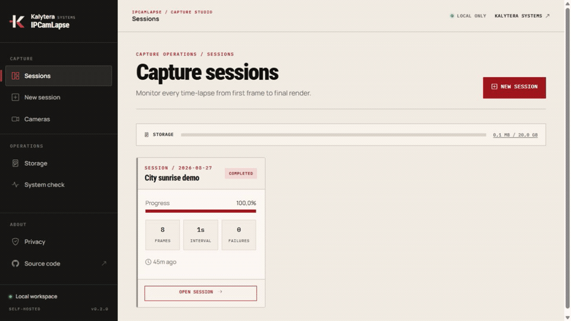
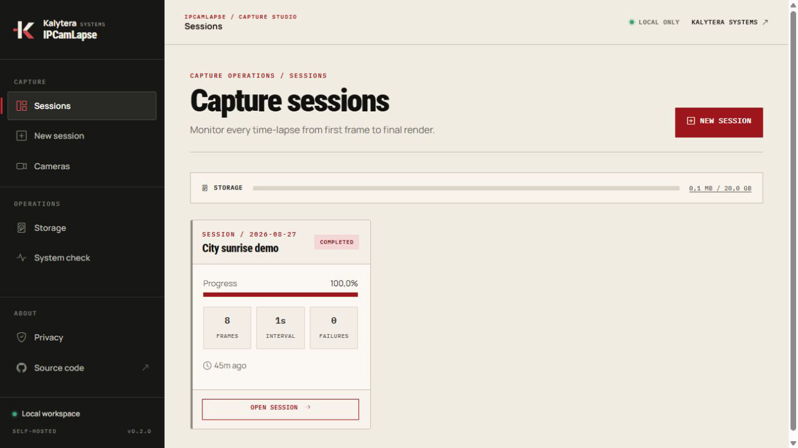
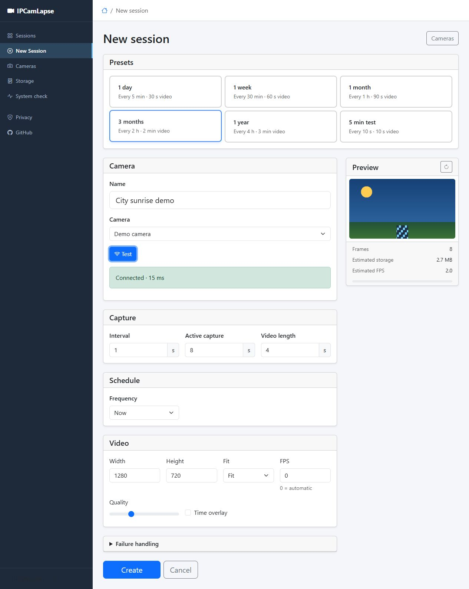
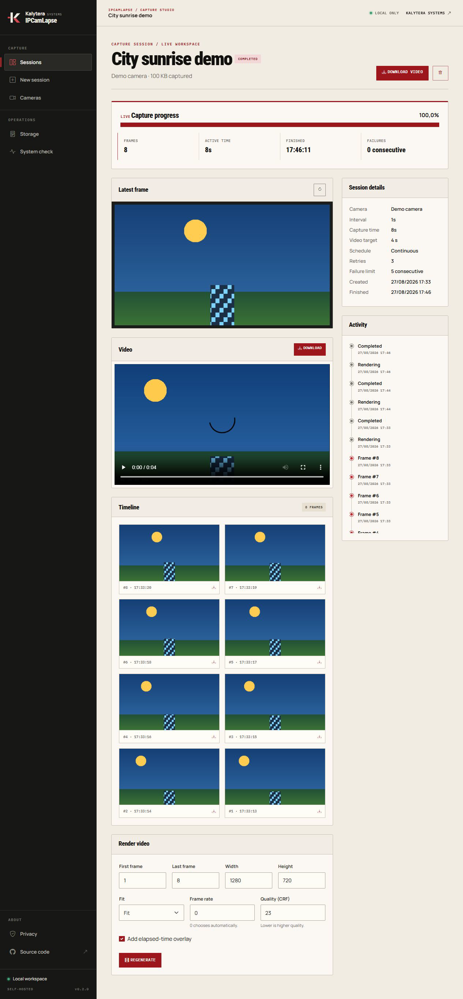

# IPCamLapse

[](https://github.com/KalyteraSystems/IPCamLapse/actions/workflows/ci.yml)
[](https://github.com/KalyteraSystems/IPCamLapse/actions/workflows/codeql.yml)

IPCamLapse is an open-source [Kalytera Systems](https://kalyterasystems.com) capture tool that turns IP camera snapshots into time-lapse videos from a local web interface. Its simulated camera makes the complete capture-to-video workflow available without hardware.



## What it does

- Runs multiple capture sessions with explicit scheduled, capturing, paused, rendering, completed, and failed states
- Measures active capture time correctly across pauses and schedule windows
- Keeps captures on a fixed timeline even when camera requests are slow
- Retries failed snapshots with exponential backoff and clear diagnostics
- Saves reusable camera profiles with protected credentials
- Offers a hardware-free demo camera
- Schedules one-time, daily, or weekly captures, including overnight windows
- Tracks estimated and actual storage, disk reserve, retention, and low-space warnings
- Browses and downloads frames from a paged timeline gallery
- Renders any frame range with resolution, fit/crop, frame rate, quality, and elapsed-time overlay controls
- Regenerates and downloads H.264 MP4 videos

| Sessions | New session | Timeline |
|---|---|---|
|  |  |  |

## Try it

Download a self-contained Windows x64 or Linux x64 archive from [Releases](https://github.com/KalyteraSystems/IPCamLapse/releases), extract it, and run `IPCamLapse.exe` on Windows or `./IPCamLapse` on Linux. Open <http://127.0.0.1:5000>, create a session with **Demo camera**, and press Start.

FFmpeg is needed to render video. Put `ffmpeg.exe` beside the application on Windows or install `ffmpeg` in a standard system path on Linux. The System check page verifies FFmpeg, data-directory permissions, and free disk space. New installations keep runtime data in the operating system's local application-data directory; an existing `data` directory beside the app is reused automatically.

## Run from source

Requirements:

- [.NET 10 SDK](https://dotnet.microsoft.com/download/dotnet/10.0)
- [FFmpeg](https://ffmpeg.org/download.html) for video rendering
- An HTTP or HTTPS JPEG snapshot endpoint for a real camera

```console
git clone https://github.com/KalyteraSystems/IPCamLapse.git
cd IPCamLapse
dotnet restore --locked-mode
dotnet run --project IPCamLapse --urls http://127.0.0.1:5080
```

Open <http://127.0.0.1:5080>. The built-in demo camera works immediately.

## Run with Docker

Docker images include FFmpeg and run as a non-root user. Run the published image directly:

```console
docker run --detach --name ipcamlapse --restart unless-stopped --publish 127.0.0.1:5080:8080 --env LocalAccess__AllowPrivateNetworks=true --volume ipcamlapse-data:/data ghcr.io/kalyterasystems/ipcamlapse:latest
```

Open <http://127.0.0.1:5080>. Captures, profiles, settings, and credential-protection keys are kept in the `ipcamlapse-data` volume. The `latest` and versioned images at `ghcr.io/kalyterasystems/ipcamlapse` support Linux AMD64 and ARM64.

The command publishes the port on host loopback only. It explicitly allows private bridge traffic inside the container so requests forwarded by Docker can reach the app. Do not change the host binding to `0.0.0.0` unless an authenticated reverse proxy supplies the missing access control.

## Configuration

Environment variables use double underscores, such as `Storage__DataPath=/srv/ipcamlapse`.

| Setting | Default | Purpose |
|---|---:|---|
| `Storage:DataPath` | OS local application data | Runtime data directory; relative overrides resolve from the application directory |
| `DataProtection:KeysPath` | OS default; container: `data-protection-keys` | Data Protection key directory; relative overrides resolve from the runtime data directory |
| `LocalAccess:AllowPrivateNetworks` | `false` | Accept private bridge clients; intended for loopback-published containers |
| `CameraAccess:AllowHostnames` | `false` | Allow DNS hostnames in camera URLs |
| `CameraAccess:AllowPublicAddresses` | `false` | Allow public camera addresses |
| `CameraAccess:MaxSnapshotBytes` | `20971520` | Maximum snapshot response size |

Storage limits, disk reserve, retention, and frame-size estimates can be changed in the web interface.

## Security

- The web interface accepts loopback connections only by default and has no user authentication.
- Camera URLs default to HTTP or HTTPS literal private, loopback, or link-local addresses.
- TLS certificates are checked unless a camera profile explicitly disables validation.
- Camera passwords are protected with ASP.NET Core Data Protection.
- Snapshot responses are bounded and validated as JPEG images.
- State-changing requests require antiforgery validation.

Do not bind IPCamLapse directly to a LAN or the internet. See [SECURITY.md](SECURITY.md) for deployment assumptions and vulnerability reporting.

## Data and upgrades

Runtime data is stored under the configured data path and excluded from Git. Back up and restore the container volume as a unit: saved camera passwords cannot be recovered from profile or session JSON without its Data Protection key ring. Existing v0.1 session JSON remains readable. A session interrupted by an application restart is restored as paused rather than silently resumed.

Before replacing a container first created with v0.4.3 or earlier, migrate its existing key ring into the mounted volume while that container is still running:

```console
docker exec ipcamlapse sh -c 'mkdir -p /data/data-protection-keys && cp /home/app/.aspnet/DataProtection-Keys/key-*.xml /data/data-protection-keys/'
```

Without that one-time migration, saved camera passwords must be entered again after the upgrade.

See [Architecture](docs/ARCHITECTURE.md) for the lifecycle, timing model, storage layout, and component boundaries. Planned work is tracked in the [Roadmap](docs/ROADMAP.md), and release changes are listed in the [Changelog](CHANGELOG.md).

## Development

```console
dotnet restore --locked-mode
dotnet build --configuration Release --no-restore
dotnet test --configuration Release --no-build
dotnet format --verify-no-changes --no-restore
dotnet list package --vulnerable --include-transitive
```

CI runs on Windows and Ubuntu. The integration suite exercises demo capture → render → HTTP download. Read [CONTRIBUTING.md](CONTRIBUTING.md) before opening a pull request, and look for [`good first issue`](https://github.com/KalyteraSystems/IPCamLapse/labels/good%20first%20issue) tickets if you want a small starting point. Maintainer release steps are in [Releasing](docs/RELEASING.md).

## Maintainer

IPCamLapse is maintained by [el kampu](https://github.com/elkampu) through [Kalytera Systems](https://github.com/KalyteraSystems). Product and company information is available at [kalyterasystems.com](https://kalyterasystems.com).

## License

[Apache License 2.0](LICENSE). Browser-library licenses are listed in [THIRD_PARTY_NOTICES.md](THIRD_PARTY_NOTICES.md).
